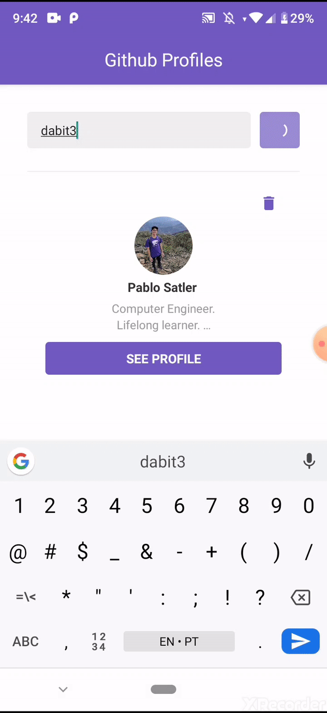

<p align="center">
  

  <a href="https://www.linkedin.com/in/pablosatler/">
    
  </a>

  

</p>

> Listing Github's profile starred repos

The application consumes the REST Github API and display some pieces of information
about the repositories inserted by the user.

On the profile page it is displayed the repositories the user has starred on Github.
The documentation for the github stars can be found [here](https://developer.github.com/v3/activity/starring/#list-repositories-being-starred).

## How to run

```
git clone https://github.com/psatler/react-native-github-app
cd react-native-github-app
yarn (or npm install)
yarn start
```

PS: This assumes you have the `react-native cli` installed. You might need it to run `react-native run-android (or run-ios)` before `yarn start`.

## Some dependecies used

- [ESLint](https://github.com/eslint/eslint)
- [Prettier](https://github.com/prettier/prettier)
- [EditorConfig](https://github.com/editorconfig/editorconfig)
- [Styled Components](https://github.com/styled-components/styled-components)
- [React Navigation](navigation)
- [React Native Vector Icons](https://github.com/oblador/react-native-vector-icons) (MaterialIcons)
- [Prop-types](https://github.com/facebook/prop-types)
- [Axios](https://github.com/axios/axios)
- [Async Storage](https://github.com/react-native-community/async-storage) to save and load saved list of repositories
- [React Native Webview](https://github.com/react-native-community/react-native-webview/blob/master/docs/Getting-Started.md) to view the repository's page

## Features

- Infinite scroll on the details page listing the user's favorite repositories (starred ones)
- Pull to refresh
- Open the favorite repo in a webview to get more details of it

You can check some of the features at the animations below:




## License

This project is licensed under the terms of the [MIT License](https://opensource.org/licenses/MIT) © Pablo Satler 2019
